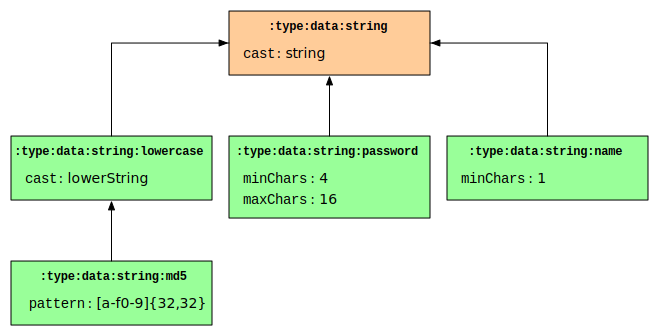

# Types

> `Types` are `terms` that represent *data types*, *schemas*, *structures*, *categories* and *ontologies*.

A *term* becomes a *type* when its reference in an object's property is used to indicate a data or other type, or when it is used as a node in a directed graph.

#### Data types

Data types are terms used to indicate the kind of data a property may hold, it is used in *descriptors* to provide an indication on the type of data the property will hold and to provide guidelines on how to validate data. Type terms are also connected among each other in a directed graph representing a tree that originates with the *primitive data types* and extends to *specialised data types*, each level provides increasing detailed information about the format and validation of the data.



Descriptors have a `:type:data` property that contains an object reference of a type term, in the above diagram this would be a green leaf node of the graph. The top node represents the primitive data type, in this case a string, while the child nodes represent more specialised types that are derived from their connected more general types.

In the above example the left green `:type:data:string:md5` node represents the data type for an MD5 hash in character format (not binary), validation proceeds top-down from the more generalised type to the more specific type.

The first operation triggered by the primitive data type would be to cast the value to a string. The derived data type, `:type:data:string:lowercase`, in the second level indicates a lowercase string data type, the validating operation would be to convert the string to lowercase. The final node, `:type:data:string:md5`, is derived from the preceding data type and assumes the string is already in lowercase: the type would validate the string against the pattern, which expects a string of exactly `32` characters composed of the letters `a` through `f` and digits.

The middle leaf node represents a lowercase string of size ranging from 4 to 16 characters.

The right leaf node represents a type derived from the default `:type:data:string:date` type and checks whether the provided string date ranges between the year `1990` included and is before the year `2000`.

##### *String primitive* `:type:data:string`
This is the primitive string data type, it indicates a *text* value of undetermined size; by text we mean a string of `UTF8` characters, rather than a string of binary data.

By default, this data type will cast the value to a string, the only possible error is that the string contains invalid UTF8 characters.

Types derived from this one may feature the following properties that determine the kind of validation operations.

- `str-pattern` *String pattern*, the property holds the *pattern* string.


In general most strings can be validated using a pattern, preferring this form would add to consistency.

- `str-min-char` *Minimum characters length*, the minimum length of the string expressed in *UTF8 characters*; this means that the byte length of the string could be greater than this value.
- `str-min-byte` *Minimum bytes length*, the minimum length of the string expressed in *bytes*; it means that this value may be greater than the previous property value,
- `str-max-char` *Maximum characters length*, the maximum length of the string expressed in *UTF8 characters*; this means that the byte length of the string could be greater than this value.
- `str-max-byte` *Maximum bytes length*, the maximum length of the string expressed in *bytes*; it means that this value may be greater than the previous property value, 


If the string is larger than the maximum length, unless the trim flags are set, the value will be considered invalid; if the string is shorter than the minimum length, the value will be considered invalid in all cases.

- `str-trim` *Trim flag*, the property holds a character value indicating whether the string should be trimmed on the left (beginning) or right (end) in order to fit its size to the maximum length: `L` means left and `R` means right.

The trimming directives will only be considered if maximum or fixed length was indicated; if no trimming directive is provided and the string is larger that the fixed or maximum length, this will be considered an invalid value. If you provide a trimming directive you *must be consistent* in the type of minimum and maximum length: you cannot mix characters with bytes. When trimming byte lengths, it will actually be the number of characters to be trimmed: the string will be shortened until the byte length is smaller or equal to the required limit, which might result in a total byte length smaller than the limit.

- `str-fix-char` *Fixed length*, the property holds the *fixed length* of the string, this means that the string must have exactly that length *in UTF8 characters*. If you provide this property you should not provide the minimum and maximum length attributes, these will be ignored. When providing a fixed length you can provide a set of filling tokens to automatically make the string of correct length:
- `str-pad-left` *Left fill token*, this property holds a character that will be applied to the left (beginning) of the string as many times as necessary to make the string the required size.
- `str-pad-right` *Right fill token*, this property holds a character that will be applied to the right (end) of the string as many times as necessary to make the string the required size.

If the string is smaller than the required fixed length, if filling tokens were provided it will be made that length; if no filling pattern was provided, the value will be considered invalid. If larger than the required length the value will be considered invalid if no trimming flag was provided.

- `str-case` *Case*, the property holds a character value indicating whether the string should be converted to uppercase or small case: `U` means uppercase and `L` means lowercase.

Range checking can also be applied to strings:

- `range-min-inc` *Minimum inclusive value*, the property holds a character value indicating the lowest value the string can *take, including the limit itself*. This means that if the limit is `c`, "c" would be valid, along with all higher order strings.
- `range-min-exc` *Minimum exclusive value*, the property holds a character value indicating the lowest value the string can *take, excluding the limit itself*. This means that if the limit is `c`, "c" would not be valid, but "d" and any larger string would.
- `range-mac-inc` *Maximum inclusive value*, the property holds a character value indicating the highest value the string can *take, including the limit itself*. This means that if the limit is `c`, "c" would be valid, along with all lower order strings.
- `range-max-exc` *Maximum exclusive value*, the property holds a character value indicating the highest value the string can *take, excluding the limit itself*. This means that if the limit is `c`, "c" would not be valid, but "b" and any lower string would.

The order in which the validation will proceed is as follows:

1. The value will be cast to a UTF8 string, if that fails, an error will be raised.
2. `str-case` The value will be set to upper or lower case.
3. `str-pattern` The string will be validated with the provided pattern and *steps 4 through 9 will be skipped*.
4. `str-fix-char` If this attribute was provided:
   1. `str-trim` If the length is greater than required, the value will be trimmed, if not, an error will be raised.
   2.  `str-pad-left` If the string is smaller than required, it will be left trimmed.
   3. `str-pad-right` If the string is smaller than required, it will be right trimmed.
5. `str-min-char` If the character count is smaller than the provided value an error will be raised.
6. `str-max-char` If the character count is larger than the provided value:
   1. `str-trim` The value will be trimmed, if not, an error will be raised.
7. `str-min-byte` If the byte count is smaller than the provided value an error will be raised.
8. `str-max-char` If the byte count is larger than the provided value:
   1. `str-trim` The value will be trimmed, if not, an error will be raised.
9. `str-max-byte` If the byte count is larger than the provided value:
   1. `str-trim` The value will be trimmed by reducing the character count until the byte count is less or equal to the limit; if not, an error will be raised.
10. `range-min-inc` If the string is less than the provided value an error will be raised.
11. `range-min-exc` If the string is less than or equal to the provided value an error will be raised.
12. `range-max-inc` If the string is greater than the provided value an error will be raised.
13. `range-max-exc` If the string is greater than or equal to the provided value an error will be raised.

##### *Examples*

A string validated by a pattern expecting a field of 3 uppercase characters followed by 4 digits:

```javascript
{
  ...,
  str-pattern:  "[A-Z]{3}[0-9]{4}"
}
// "ABC1234": Valid.
// "ABCDE34": Invalid.
```

A string of size ranging from 1 to 6 characters:

```javascript
{
  ...,
  str-min-char: 1,
  str-max-char: 6
}
// "1": Valid.
// "ABCDEF": Valid.
// "ABCDEFG": Invalid.
// "": Invalid.
```

A string containing at most 5 characters, but not larger than 8 bytes:

```javascript
{
  ...,
  str-max-char: 5,
  str-max-byte: 8
}
// "gatto": Valid, 5 characters 5 bytes.
// "mačka": Valid, 5 characters 6 bytes.
// "կատու": Invalid, 5 characters 10 bytes.
```

A string of at most 4 characters with left trimming:

```javascript
{
  ...,
  str-max-char: 4,
  str-trim: "L"
}
// "1234": no trimming.
// "123456": results in "3456".
```

A string of at most 4 characters with right trimming:

```javascript
{
  ...,
  str-max-char: 4,
  str-trim: "R"
}
// "1234": no trimming.
// "123456": results in "1234".
```

A string of 4 characters:

```javascript
{
  ...,
  str-fix-char: 4
}
// "ABCD": Valid.
// "12345": Invalid.
// "123": Invalid.
```

A string of 4 characters left padded with zeros:

```javascript
{
  ...,
  str-fix-char: 4,
  str-pad-left: "0"
}
// "ABCD": Does not change.
// "12": Becomes "0012".
```

A string of 4 characters right padded with dashes:

```javascript
{
  ...,
  str-fix-char: 4,
  str-pad-right: "-"
}
// "ABCD": Does not change.
// "AB": Becomes "AB--".
```

##### *Default derived types*

There are a set of default string derived types that are built-in:

 `:type:data:string:date` *Date string*

This type indicates a date and time value in which the year is the only required part. The value follows a `YYYYMMDDhhmmss` format in which `Y` indicates the year, `M` the month number, `D` the day number, `h` the 24 hour, `m` the minute and `s` the second.

This type is useful in situations where not all information may be there, the format allows to mix precise and indicative information without the need to modify the original data and it lends itself to correct sorting.

The valid combinations are as follows:

- `YYYYMMDDhhmmss`: all data is there.
- `YYYYMMDDhhmm`: missing seconds.
- `YYYYMMDDhh`: missing minutes.
- `YYYYMMDD`: missing time.
- `YYYYMM`: missing day.
- `YYYY`: missing month.

```javascript
"19871201234558": // December 1st 1987 at 11:45:58 PM.
"200011": // November 2000.
"1990": // In the year 1990.
```

This type will only ensure the date and time are correct.